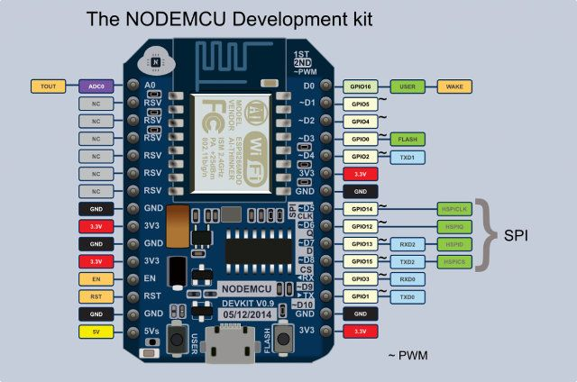
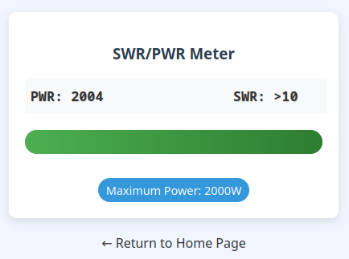
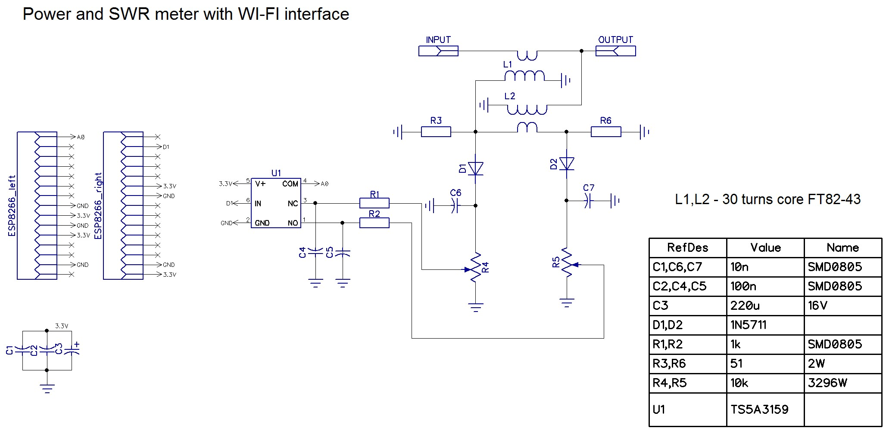
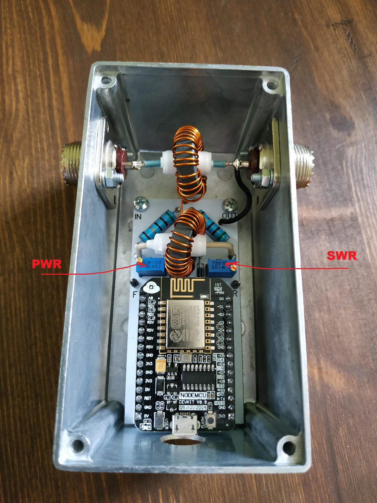

# SWR_PWR_meter
SWR and PWR meter with wifi interface
Based on esp8266 (NodeMCU 0.9)

More information (in Russian) - https://ra0sms.com/swr_power_meter/

[Gerber files](gerber/SWR_gerber.zip )

[Source code (Arduino IDE)](src/swr_source/swr_source.ino)

**Make sure that you use esp8266 board v 0.9. Check pinout!**

